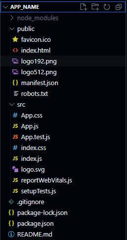
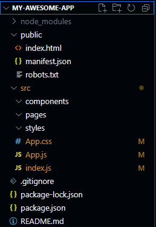
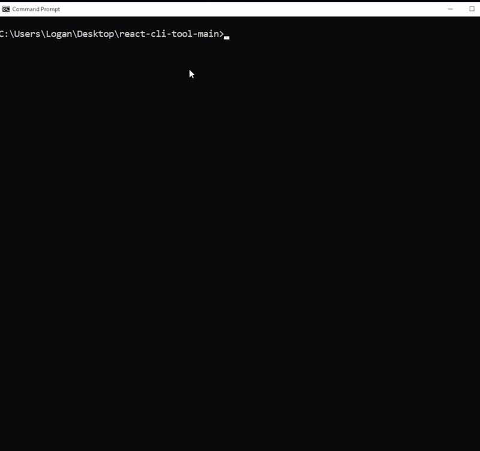

# React Project CLI Tool

This CLI (Command Line Interface) tool is designed to streamline the process of setting up a new React project. It automates various tasks such as creating a project structure, removing unnecessary files, and initializing a Git repository.

# Choose the React Project CLI Tool for a Streamlined React Setup

## Quick and Clean Start
- **Efficient Initialization**: Begin new React projects swiftly, without the hassle of removing redundant files and code. This tool significantly reduces setup time.
- **Optimized Project Structure**: Enjoy a clean, minimal setup, focusing only on essential development elements.

## Enhanced Development Experience
- **Pre-configured Flexibility**: Get a ready-to-code setup that's adaptable to your project needs.
- **Git Integration from the Start**: Dive into coding with version control already established.

## Developer-Centric Design
- **Built by a Developer, for Developers**: Addressing common setup frustrations, this tool is crafted for practical, efficient development.
- **Community-Inspired Updates**: Regular enhancements reflect the evolving needs of the React developer community.

## Visual Comparison: Default vs. React Project CLI Tool

### Default `create-react-app` Structure

*Note: Typical cluttered structure with unused files and boilerplate code.*

### React Project CLI Tool Structure

*Note: Streamlined and efficient, free from redundant files, imports, and comments, ensuring a quick start to coding.*

By using the React Project CLI Tool, you step into an environment designed for immediate productivity and creativity.

## Prerequisites

Before you begin, ensure you have the following installed on your system:
- Node.js (Download and install from [Node.js official website](https://nodejs.org/))
- Git (Download and install from [Git official website](https://git-scm.com/))

## Downloading the Tool

To download the React Project CLI Tool, follow these steps:

1. **Clone the Git Repository**:
   - Open your terminal.
   - Navigate to the directory where you want to place the tool.
   - Run the following command:
     ```bash
     git clone https://github.com/TheTallProgrammer/react-project-cli-tool.git
     ```
   - This command will create a copy of the tool in a directory named `react-project-cli-tool`.
   - You need an instance of this tool on your machine when you want to use it, so pick a good spot to keep it in.

2. **Navigate to the Tool's Directory**:
   - Change to the directory containing the tool:
     ```bash
     cd react-project-cli-tool
     ```
## Installation

Install the necessary dependencies by running:
```bash
npm install
```

To use the react-cli-tool command from any location on your system, link the package globally:

```bash
npm link
```
This command sets up a symlink that allows you to run the react-cli-tool command from anywhere on your system.

## Usage

To create a new React project, navigate to the directory where you want your project to be created and run:
```bash
react-cli-tool create <projectName>
```
Replace `<projectName>` with your desired project name. For example:
```bash
react-cli-tool create my-awesome-app
```
This command will create a new directory with the name `my-awesome-app` and set up a React project within it.

### What This Tool Does

When you run the command, the tool will:

1.  Create a new React project using `create-react-app`.
2.  Navigate into the project directory.
3.  Remove some default files that are typically not needed.
4.  Create a standard directory structure for React projects (components, pages, styles).
5.  Initialize a new Git repository.

## Interactive Video Demonstration

For a comprehensive understanding of how the React Project CLI Tool enhances your development workflow, please view our video demonstration below. This visual guide walks you through the installation process and showcases the tool's capabilities in action.



## Troubleshooting

-   **Command Not Found**: If you get an error saying "command not found" after installation, close and reopen your terminal, or log out and log back in to your system. This refreshes your system's path.
    
-   **Permission Issues**: If you encounter permission issues during installation, try running the install command with `sudo`:
	```bash
	sudo npm install -g react-project-cli-tool
	```
